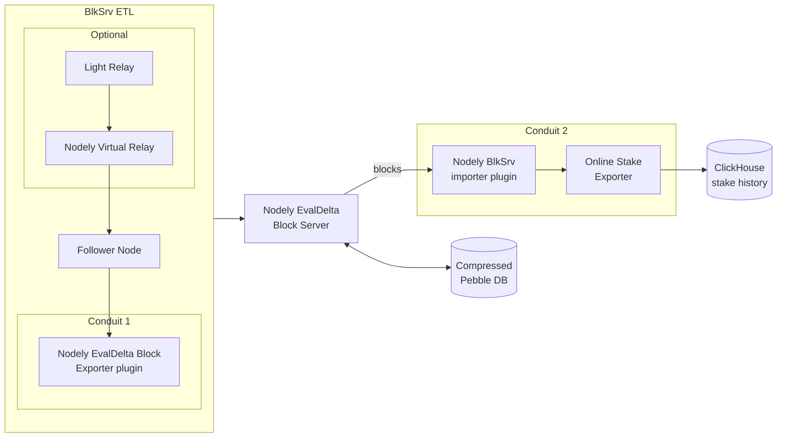

# Nodely BlkServer

This is an Algorand block (payset+evaldelta+cert) storage server. 

* Use Nodely Block exporter conduit plugin to import blocks with eval deltas into the server.
* Use Block server as virtual follower node or natively with Nodely BlkSrv importer conduit plugin.

# Example use 

